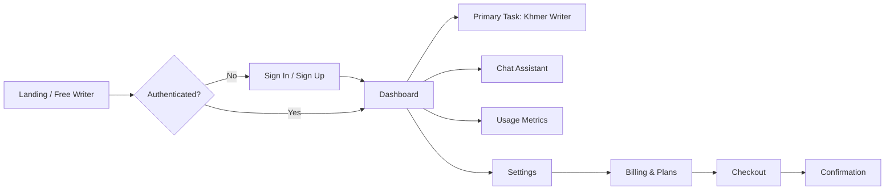
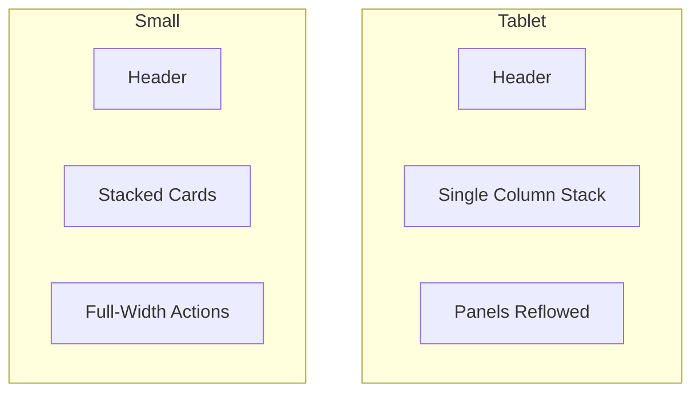

# iOS 26 Web UX/UI Design Doc

## Scope
- Desktop-first web app with responsive scaling down to small screens.
- Top navigation, no mobile-native bottom tabs.
- Light/dark modes with a single accent color and soft glass surfaces.

## User Flow


## Wireframes (Desktop)
```mermaid
flowchart TB
  subgraph Landing
    L1[Top Nav: Logo | Sign In | Start Free]
    L2[Hero: Title + Supporting Copy]
    L3[Primary Task Panel: Writer]
  end

  subgraph Dashboard
    D1[Sidebar: Nav + Tier]
    D2[Header: Context + Actions]
    D3[Stats Grid]
    D4[Content Panels]
  end

  subgraph PrimaryTask
    P1[Task Header]
    P2[Editor Panel]
    P3[Suggestions Panel]
    P4[NER Panel]
  end

  subgraph Confirmation
    C1[Summary Card]
    C2[Primary Action]
    C3[Secondary Action]
  end
```

## Wireframes (Responsive)


## Design System Notes
- Accent: single system blue for actions, links, and active states.
- Surfaces: translucent glass cards with blur and low-contrast borders.
- Type: SF-inspired system stack; clear hierarchy and relaxed line-height.
- Motion: short, smooth transitions only.
- Accessibility: visible focus rings, keyboard navigation, no color-only cues.

## Implementation Notes
- Light/dark tokens defined in `app/globals.css`.
- Glass components, buttons, and navigation reuse global utilities.
- App UI serves as the live prototype for clickable interactions.
